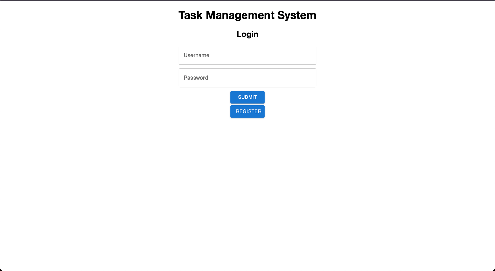
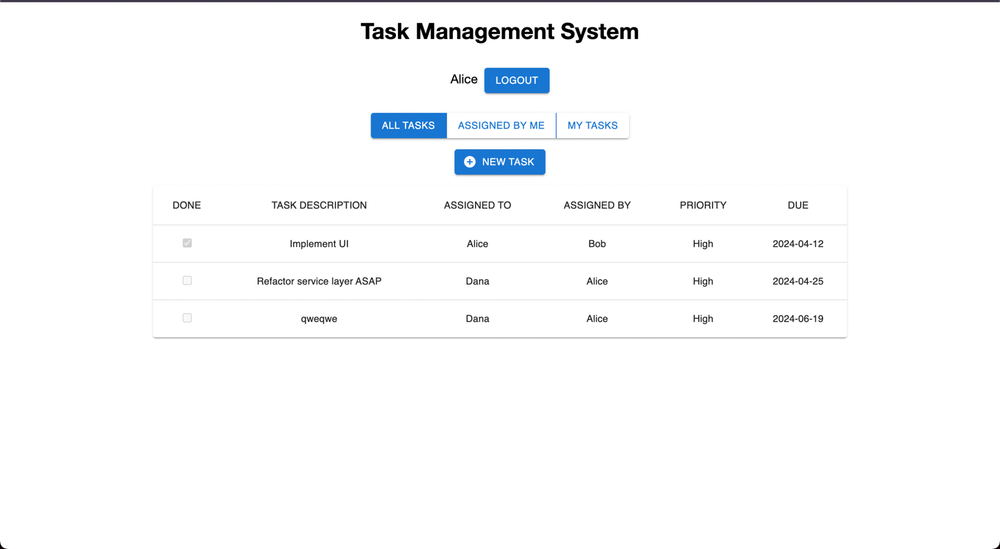

# Task Management System

This project is a simple task management system built with React for the frontend and Node.js with Express for the backend. It utilizes MongoDB for data storage. The system allows users to register, login, create tasks, and manage them through a web interface.

## Features

- User authentication (register/login)
- Session management with cookies
- CRUD operations for tasks
- Protected routes in React

## Installation

To set up the project locally, follow these steps:

### Prerequisites

- Node.js (v12.x or later)
- MongoDB (v4.x or later)

### Backend Setup
1. Clone the repository:
    ```bash
    git clone https://github.com/VelikanovDev/Task-Management-System.git
    cd Task-Management-System
    ```


2. Ensure MongoDB is running:

   Start MongoDB using your system’s service manager or by running mongod directly depending on your installation.
   The database will be pre-seeded with default user and task data for demonstration purposes.


3. Install dependencies and start project:

    Backend:
    ``` bash
     cd server
     npm install
     npm start
    ```
    Frontend:
    
    ```bash
    cd ../client
    npm install
    npm start
    ```
   
## Usage
After starting the application, navigate to the web interface to register a new user account and log in. Once logged in, you can begin adding, viewing, editing, and deleting tasks.


